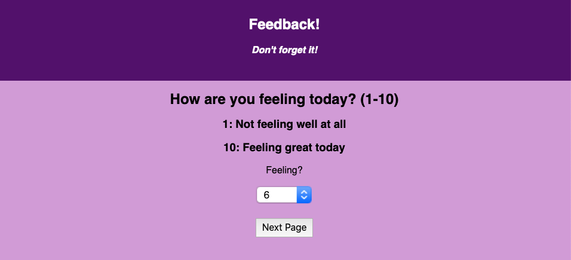
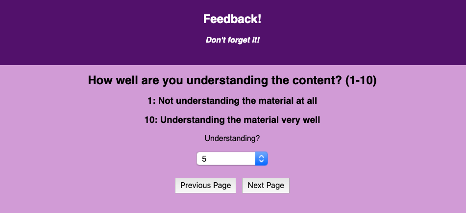
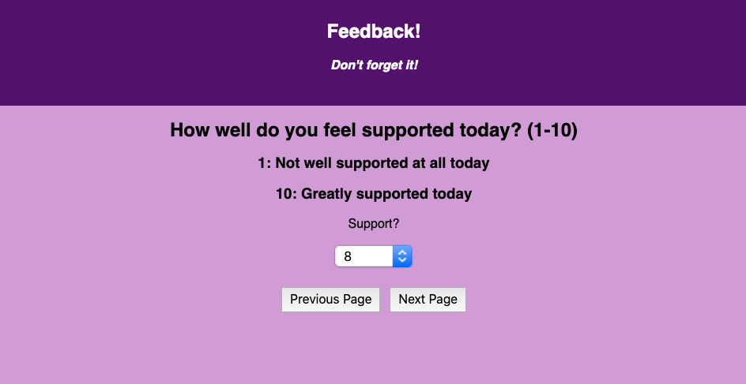
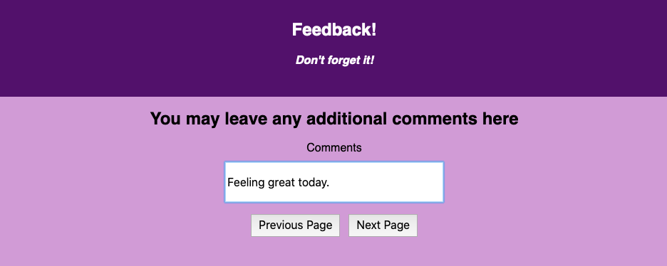
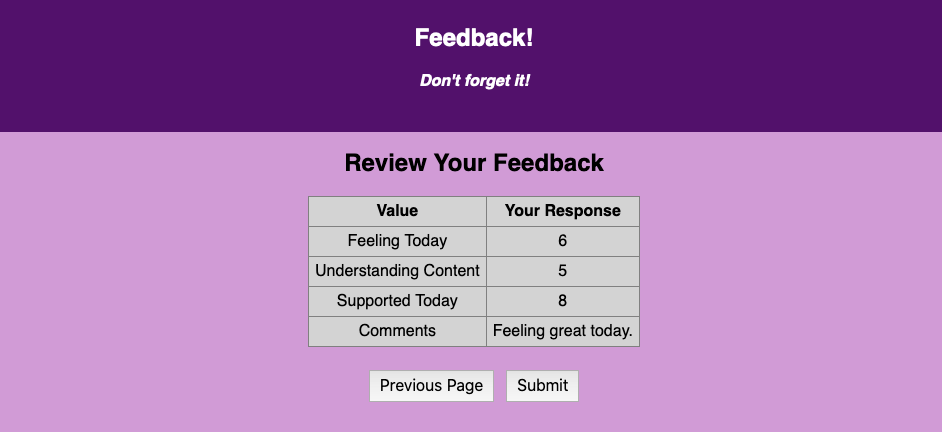
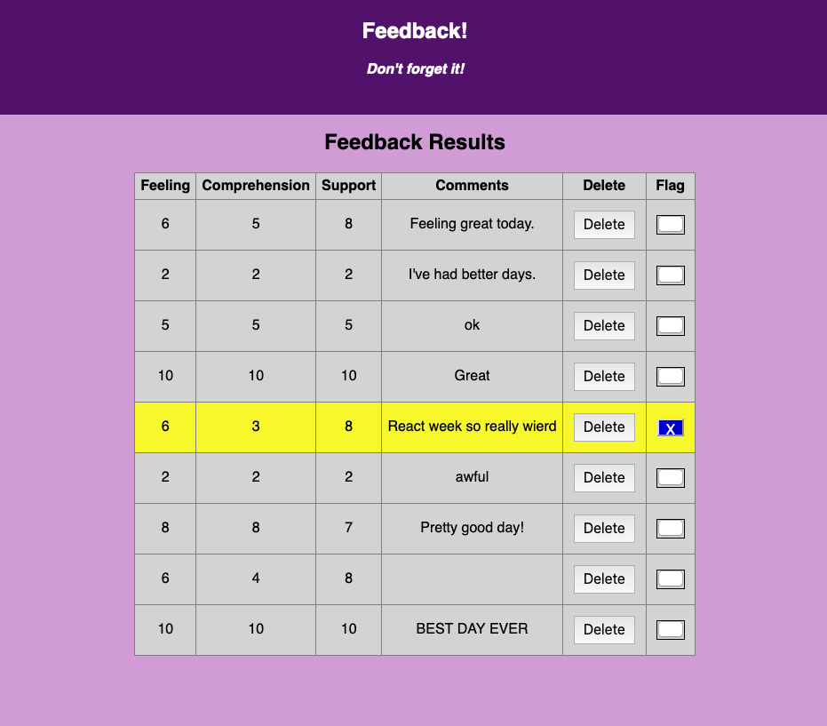

# Redux Feedback Loop

## Description

Duration: 54 hours - evening 10/30/2020 - evening 11/1/2020

This project is an app to collect feedback from the user regarding daily class.  There is a section to retrieve their feeling, content understanding, and support values, as well as any other comments for the day.  There is a review page to show them what they have entered to verify, and a thank you page before it returns to the beginning again.  There is also a page to let an administrator view feedback that has been previously entered and stored in the database.

This project was the first involving Redux, and although it was brand new this week, it worked very well for me in completing the assignment.  The challenge lied in the function of the delete and flag buttons in the admin component.  I had a tough time getting ids to attach to them and understanding how to use anonymous arrow functions, and to make the checkboxes work properly.  Eventualy, I got the id successfully, and decided to make my own button with a toggle functionality, which worked much better than trying to use premade checkboxes.

## Screen Shots

Feeling Component

Understanding Component

Support Component

Comments Component

Review Component

Thank You Component

Admin Component

### Prerequisites

- The project requires Node.  It may be downloaded here: https://nodejs.org/en/

- The project requires the creation of a database.  Postgresql was used for this project.  The database is titled 'prime_feedback' and a command for creating the "feedback" table is in the data.sql file.  Postgresql may be found here: https://www.postgresql.org/.  Postico also may be used to visually see the database.  It is found here: https://eggerapps.at/postico/

- The project requires an understanding of HTML, CSS, JavaScript, React with Redux, http requests to a server, queries to a database, and an understanding of pool.

## Installation

This project can be forked and cloned from the Github repository.  It has many dependencies that can be installed using the command 'npm install'.  

A Postgresql database is required.  It needs to be called 'prime_feedback', and the table can be created by copying the contents of the data.sql file into Postico and executing.

In the terminal, enter the command 'npm run server'.  Open a new terminal window, and enter the command 'npm run client'.  This should open the browser at the initial page, which asks the user how they are feeling today.

## Usage 

1.  On pageload, the app will be brought to the feeling component, which asks the user to choose a value for how they are feeling today.  A dropdown box is used for this, with input validation that requires a choice between 1 and 10.  

2.  This is repeated for the next two page components, requesting their input for understanding of material and level of support for the day.

3.  The next page is available for the user to add comments, if they wish.

4.  On the next page, the previously saved values for the previous components are displayed for the user to review.  At this point, the user may return to any of the previous pages and update their input and return to this review page.  These values are only saved when the user advances pages, not going backwards, just in case they changed an input inadvertently, and continued backwards.  When the submit button is clicked, all feedback input values are sent to the database for storage, and Redux values are cleared for the next entry to be created fresh.

5.  The next page has a message thanking the user for their feedback, and a button that returns them to the beginning of the feedback loop.

6.  If the browser is directed to localhost:3000/#/admin, the admin component is displayed.  Here, previous entries are retrieved from the database and displayed.  The submission values for feeling, understanding, support and comments are in a table.  One button exists to allow the administrator to delete a feedback entry, with a confirmation check alert, and another button exists to flag an entry for review later with the row turning yellow to highlight it.

## Next Steps

1.  If I return to the project, I would try to determine how to make the input box in the comments section advance to a second line after the first is filled in.

2.  I would also try to break the select dropdown boxes, as well as the tablea in the review and admin components, into separate components to make things simpler.

3.  I would also display the date the feedback was entered.  

## Built With

- Redux
- React
- CSS
- Node
- Express
- JavaScript
- HTML
- Postgresql
- Pool
- Axios